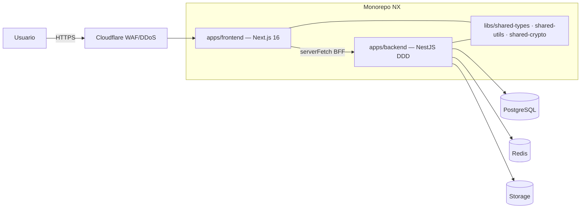

# 01 — Architecture

> Documento vivo. Actualizar con cada decisión arquitectónica (ADR), nuevo índice
> de BD, o cambio en las capas DDD.

## Diagrama de alto nivel



En local (Etapa 1) no hay Cloudflare/Auth0/GCS: el browser pega a Next.js
(localhost:3000), Next.js pega a NestJS (localhost:3001), NestJS a Postgres/Redis
Docker. Auth con `DevAuthGuard` (headers `x-dev-user-id`, `x-dev-user-role`).

## Capas DDD del backend (regla de dependencia unidireccional)

```
presentation → application → domain ← infrastructure
```

| Capa              | Contenido                                                                                     | Importa de                        |
| ----------------- | --------------------------------------------------------------------------------------------- | --------------------------------- |
| `domain/`         | entities, value-objects, repository interfaces, domain events, domain errors, factories       | nada (ni frameworks)              |
| `application/`    | use-cases (1 por acción), ports (INotificationPort, ICachePort…), DTOs                        | `domain/`                         |
| `infrastructure/` | Sequelize models + repos, Redis/GCS/Auth0 adapters, config                                    | `domain/`, `application/`         |
| `presentation/`   | controllers, guards, pipes (ZodValidationPipe), filters (GlobalExceptionFilter), interceptors | `application/`, `infrastructure/` |

Enforced por ESLint `@nx/enforce-module-boundaries`.

## Patrones obligatorios

Repository · Factory · Singleton (NestJS DI) · Strategy (notificaciones, pagos,
export) · Observer/Event-Driven (domain events) · Decorator (caché/logging/métricas).
SOLID no negociable. Cero errores sin controlar (errores de dominio tipados →
GlobalExceptionFilter).

## ADRs

- **ADR-001 (2026-06-01):** Monorepo NX **in-place** sobre el repo actual (no repo
  hermano nuevo). Razón: conservar historial git y remote. Implica `git mv` del
  Next.js a `apps/frontend/`.
- **ADR-002:** Gestor **pnpm** (vía corepack/user-local, sin sudo).
- **ADR-003 (pendiente validar):** Integración Next.js↔NX. Next 16 es muy nuevo;
  si `@nx/next` no soporta Next 16, usar target `nx:run-commands` envolviendo
  `next dev/build` nativo. Decidir al ejecutar Paso de migración del frontend.
- **ADR-004:** Backend NestJS + Sequelize + DDD. IA actual es **Gemini** (no
  OpenAI/Anthropic) — el `INotification`/AI port debe abstraer el proveedor.
- **ADR-005 (2026-06-04):** Lecturas con PII descifrada **owner-scoped** para features del propio doctor.
  `GET /api/consultations/with-patient` (billing) devuelve patient_name/phone/email descifrados —
  excepción justificada al masking por defecto: el doctor es dueño/autor y necesita el dato para emitir
  recibos. Regla: doble scope anti-IDOR (consultas Y pacientes filtrados por user.sub), **mapper dedicado**
  (NUNCA reusar el list mapper enmascarado), endpoint NO expuesto a admin/terceros. Sin audit por fila (no
  es /reveal de datos enmascarados, es acceso del dueño vía feature). El use case cruza módulos inyectando
  `PATIENT_REPOSITORY` (PatientsModule importado) — patrón ya usado por booking. **Pendiente:** pasar
  security-agent en QA sobre este endpoint.
- **ADR-006 (2026-06-04):** **RBAC por capacidades definido en BD** (módulo `capabilities`). Qué módulos/
  acciones (view/create/edit/delete) puede cada ROL se define en la tabla `role_capabilities` (seed por rol).
  Resolución **por request en el backend** (use case `ResolveCapabilities(role)` con cache Redis
  `capabilities:{role}` TTL 300s + invalidación al editar; degrada a BD si Redis cae; default-deny). El token
  (DevAuthGuard hoy, Auth0 mañana) lleva **solo el rol** — las capacidades NO se hornean en el token, así un
  cambio en BD aplica al instante sin re-login (requisito explícito del usuario). El resolver es agnóstico de
  la fuente de auth (lee `CurrentUser.role`), por eso Auth0-ready sin cambios. Enforcement: `CapabilitiesGuard`
  - `@RequireCapability(module, action)` en el backend (coexiste con `RolesGuard`, que sigue para "debe ser
    super_admin"). Frontend consume `GET /api/me/capabilities` para gating de vistas (helper `can()` en
    `lib/capabilities.ts`). **Combinación con plan_features:** un módulo se muestra si el ROL puede verlo
    (capacidades) Y el PLAN lo habilita (plan_features) — dos puertas ortogonales. Admin edita vía
    `GET/PUT /api/admin/role-capabilities` (super_admin).
- **ADR-007 (2026-06-11):** **Planes 100% parametrizables desde admin + gating doble.** `plan_configs` gana
  `role_key`+`is_permanent`; nueva `plan_prices` (períodos monthly/quarterly/semiannual/annual); `plan_features`
  añade feature_keys de IA (`ai_assistant`/`ai_transcription`/`ai_reports`). Catálogo vendible = **Delta Free
  (permanente) / Base / Plus** (legacy desactivados). El gating del doctor es la **intersección** de
  `role_capabilities` (RBAC del rol) y `plan_features` (lo que paga el plan): un módulo no habilitado por el plan
  se muestra con candado → `/doctor/upgrade`. **Downgrade perezoso:** al expirar el plan se cae a Free **sin perder
  datos** (`GET /api/doctor/features` v2 lo resuelve por request). Pagos de planes **MANUALES** + aprobación
  super_admin (sin pasarela aún). Catálogo público: `GET /api/plans` (sin auth).
- **ADR-008 (2026-06-11):** **Maestra de identidad de paciente (interna).** `patient_identities` (id global por
  `cedula_hash` HMAC, UNIQUE) + `patients.identity_id`. Resolución idempotente inyectada en create-patient y booking.
  Es **transparente al doctor**: NINGÚN endpoint expone la maestra ni la existencia de un paciente cross-doctor
  (no se filtra que otro médico lo atiende). Cédulas iguales entre doctores comparten `identity_id`.
- **ADR-009 (2026-06-11):** **Onboarding del doctor OBLIGATORIO post-SSO.** Gate full-screen (sin sidebar) tras el
  login Auth0; cédula V/E/P; **especialidad obligatoria** (el gate es por specialty, no por cédula). El `/register`
  legacy redirige a `/login` (Auth0, sin password). El rol se resuelve desde la BD (`profiles.role`), Auth0 solo da
  acceso.
- **ADR-010 (2026-06-11):** **Google Calendar/Meet OPT-IN + telemetría por sesión.** Google es opt-in: si el doctor
  conecta Google (tokens cifrados en `google_integrations`) las citas online generan `meet_link`; si no, fallback
  `.ics`/Jitsi + email. Modalidad por consultorio (`doctor_offices.modality` in_person/online/both);
  `appointments` gana `meet_link`+`office_id`; planes/citas asociados a consultorio (`pricing_plans.office_id`).
  OAuth con cookie `state` CSRF (path `/`). **Telemetría = 1 fila por sesión** (`telemetry_sessions`, `journey`
  jsonb + PiiGuard) — reemplaza `action_events` (eliminada).
- **ADR-011 (2026-06-12):** **Verificación de credenciales extensible.** `credential_verifiers` (un verificador por
  credencial) + `credential_verifications` (resultados). **MPPS automático vía SACS** (xajax, consulta por cédula,
  async no bloqueante); **colegiado = MANUAL** (sin portal). `profiles` gana `mpps_number`/`colegiado_number`/
  `verification_status`(pending/verified/rejected)/`verified_at`/`verified_by`. La verificación NO restringe acceso
  aún (preparatorio).
- **ADR-012 (2026-06-15):** **Auth dual-mode (Etapa 1 → Etapa 2).** `AppAuthGuard` (mode-aware) reemplaza
  `DevAuthGuard` directo en todos los controllers. `AUTH_MODE=dev` (default) → comportamiento idéntico a
  DevAuthGuard (headers `x-dev-user-*`). `AUTH_MODE=auth0` → `Auth0Guard` valida ID token del header
  **`x-auth0-token`** con `jose` (JWKS remoto, RS256, issuer+audience). El guard extrae email del payload,
  llama a `IdentityResolverService` (find-or-create en BD, demote de super_admin/admin a doctor para perfiles
  nuevos), y setea `request.user = { sub: <UUID perfil BD>, role: <rol BD>, email }`. El rol BD es autoritativo
  — el claim del token es solo hint. Namespace de rol: `AUTH0_ROLE_NAMESPACE` (default `https://deltamedical.app`).
  `InfraAuthModule` (@Global) registra los tres guards + `IdentityResolverService` disponibles en todo el app.
  `ALLOW_DEV_AUTH` eliminado — la prod usa Auth0, no DevAuthGuard. Dependencia nueva: `jose` v6.
- **ADR-013 (2026-06-18):** **Compartir documentos de consulta con el paciente.** Módulo
  `document-sharing`. El doctor genera un enlace público + **código de 6 dígitos (48h)**; el paciente
  abre `/documents/[token]`, ingresa **cédula + código** y descarga un **PDF consolidado** (informe/recetas/
  EHR seleccionados, generado con `pdf-lib`). El email lo envía Resend (`shared_documents_code`).
  **Doble factor:** se exige que `code` **Y** `cedula` matcheen al paciente del enlace; mismatch → mismo 422
  genérico (anti-oracle) e incrementa ambos contadores anti-fuerza-bruta. **Cédula normalizada** (strip
  espacios/guiones/puntos + uppercase) → tolerante al prefijo V/E/P (`12345678` ≡ `V-12345678`). El
  `sessionToken` post-verificación es **HMAC-SHA256(AUTH_RESOLVE_SECRET)** (no JWT, 15min); la descarga usa
  query param **`?sessionToken=`** (no `?session=`). El enlace usa **`APP_BASE_URL`** del backend (antes
  generaba `localhost`). Endpoints: 1 autenticado (doctor) + 3 públicos. Tablas `shared_document_links` +
  `document_access_codes` (migs `20260618000001`/`...02`). DEUDA Etapa 2: rate limiting real.
- **ADR-014 (2026-06-18):** **Feature `booking` gateada por plan.** La página pública `/book/:doctorId` deja
  de estar siempre activa: depende de la feature `booking` en `plan_features` del **plan efectivo** del doctor
  (resuelto con la misma lógica de downgrade perezoso). Delta Free=off; Base/Plus=on. Puerto
  `IBookingFeatureChecker` (vive en el dominio de booking, impl en infra reusa modelos de doctor-settings).
  `GET /api/booking/:id/info` expone `bookingEnabled`; `CreateBookingUseCase` lanza `BookingNotEnabledError`
  (403) como defensa en profundidad. Frontend: settings oculta el tab "Link público"/QR y `/book` muestra
  "Reservas no disponibles". **Gating de planes afinado:** Free = `{dashboard, settings, patients,
consultations}` (+ Consultorios/Plantillas sin moduleKey); deshabilitados agenda/billing/crm/ehr/finances/
  invitations/messages/reminders/reports/services/booking. Base/Plus = todo; IA solo en Plus. Legacy
  (trial/basic/professional/clinic) desactivados; quedan Free/Base/Plus.
- **ADR-015 (2026-06-18, en progreso):** **IA de texto reactivada (era Supabase).** Se reactivan 3 funciones
  que existían pre-migración y estaban como stub 501: `improve_block` (mejorar redacción de un bloque, gating
  `ai_assistant`), `summarize_report` (resumir informe, gating `ai_reports`), `patient_history` (resumen del
  historial, gating `ai_assistant`). El BFF `/api/doctor/ai` ya NO es stub: proxea a `POST /api/ai/text` (rol
  validado en el BFF; **gating por plan + super_admin bypass se aplican EN EL BACKEND** con el plan efectivo).
  El módulo backend reusa la infra de `ai-transcription` (adapter Gemini temp 0.3/maxOutputTokens 2048,
  `ai_request_log`, prompts médicos en español). **(verificar)** El endpoint backend `/api/ai/text`
  (use-case + controller `@Post('text')` + DTO) **aún no está en el código** a esta fecha — sólo existen el
  port `IAiTextGenerator` y los errores de dominio (`ai-feature-denied`/`ai-text-provider`/
  `patient-not-found-for-ai`); el cambio del BFF está **sin commitear**. Feature keys ya sembradas
  (`ai_assistant`/`ai_transcription`/`ai_reports`), desbloqueadas sólo en plan Plus.
- **ADR-016 (2026-07-07):** **Gating de plan a nivel de PÁGINA (frontend) + proxy de imágenes para PDF.**
  (1) **Gate por página:** el sidebar del doctor pintaba un candado SOLO visual; entrar por URL directa o enlace
  cross-módulo saltaba el gate. Se agrega un guard centralizado en `doctor/layout.tsx` (`PLAN_GATED_ROUTES` ruta→feature +
  `resolveGatedModuleKey()`) que reemplaza el contenido por un interstitial `PlanLockedNotice` → `/doctor/upgrade` si el
  plan efectivo no habilita el módulo (no bloquea mientras `planFeatures===null`, evita flash). Es enforcement de **UX**;
  el backend sigue siendo la puerta dura (deuda: chequeo de plan por módulo en backend, hoy solo en `booking`).
  (2) **Proxy de imágenes GCS:** `@react-pdf/renderer` carga imágenes con `fetch()` (preflight CORS) y el bucket GCS no
  tiene CORS para `deltasalud.app` → logos/firmas no cargaban en el PDF. Se agrega el BFF `GET /api/storage/image-proxy`
  (fetch server-side, guard anti-SSRF `https://storage.googleapis.com/` + `redirect:'error'` + `nosniff`). **Bug de raíz
  relacionado:** concatenar `?t=Date.now()` a una signed URL v4 de GCS rompe la firma (doble `?`) → 403 (rompía el preview
  de subida y guardaba URL rota en BD del avatar). **✅ RESUELTO 2026-07-08:** se configuró **CORS en el bucket**
  `delta-files-sodium-shard-499116-r3` (GET/HEAD desde deltasalud.app/www + Cloud Run; `gcloud storage buckets update
--cors-file`) y `MedicalDocumentPdf.proxyGcsUrl()` ahora devuelve la **URL directa de GCS** (verificado en prod: react-pdf
  baja logo+firma directo, 0 hits al proxy). El route `/api/storage/image-proxy` se **deja como fallback** (re-activable
  descomentando en `proxyGcsUrl`).
- **ADR-020 (2026-07-10):** **El PDF que descarga el paciente al compartir = el MISMO `MedicalDocumentPdf` branded que baja
  el doctor, renderizado server-side con datos EN VIVO.** Antes el paciente recibía un PDF distinto (backend `pdf-lib`, sin
  logo/firma) vs la descarga del doctor (react-pdf client-side). Decisión del usuario: una sola fuente de verdad + refleja
  ediciones posteriores. **Arquitectura:** el backend NO genera el PDF; expone `GET documents/:token/render-data` (valida el
  sessionToken con `SessionTokenValidatorService` = HMAC extraído del download; devuelve consulta viva + `consultationBlocks`
  key→label + logo/firma/matrícula + template informe con URLs firmadas + `docSelection` + `ehrRecords[]` del paciente + audit
  log). La **ruta Next `/api/documents/[token]/pdf` (runtime nodejs)** pide esos datos, arma el contenido con
  `app/doctor/consultations/consultation-documents.ts` (mismo helper que Generar Documento) y **renderiza `MedicalDocumentPdf`
  con `@react-pdf/renderer` `renderToBuffer`**. El viewer `/documents/[token]` apunta a `/pdf` (la ruta backend `/download`
  pdf-lib queda legacy). La selección del doctor se persiste en `shared_document_links.doc_selection` (JSONB, mig
  `20260710000002`). **Modelo de 5 tipos de documento** (receta/paraclínicos/historia/reposo/informe) compartido entre
  Generar y Compartir vía el helper; "Historia clínica" se habilita por presencia de EHR del paciente (no por nº de consultas).
- **ADR-021 (2026-07-11):** **Toda cita con paciente genera su consulta al crearse (no solo las confirmadas).**
  Antes la consulta se auto-creaba únicamente cuando la cita quedaba `confirmed`; las citas `scheduled`
  ("por confirmar") no generaban fila → NO aparecían en el módulo Consultas y NO sumaban a "Por ingresar".
  Ahora `CreateAppointmentUseCase` y `CreateBookingUseCase` (link público, best-effort no-fatal) crean la
  consulta para **cualquier** cita con `patientId`, idempotente por `consultationId` (y `UpdateAppointmentStatus`
  no la duplica al confirmar). La consulta hereda `amount = appointment.plan_price`. La lista muestra un badge
  **"Por confirmar"** para `appointment_status='scheduled'`. **Finanzas "Por ingresar"** ahora suma
  `COALESCE(c.amount, a.plan_price, 0)` para consultas `pending` (LEFT JOIN appointments) — arregla el $0
  crónico y cubre filas legacy sin migración de datos. Bloque `prescription` renombrado a **"Récipe"** en toda
  la UI + `consultation_block_catalog.default_label` (mig `20260711000001`, fijos enabled/orden). Errores de
  horario de consultorio ahora en **español con nombre del día**; `ZodValidationPipe` devuelve el primer error
  de campo (no "Validation failed"). Modales de captura ya **no cierran por click en el backdrop**.
- **ADR-022 (2026-07-12):** **Acciones frecuentes o con polling van a route handler (BFF), no a Server Action.**
  Los **IDs de Server Action de Next se rehashean por build** → tras cada deploy los clientes viejos invocan un
  ID que ya no existe y truena "Server Action not found". Esto causó (a) que guardar receta fallara tras deploy y
  (b) ~6000 eventos de ruido en Sentry desde el bell de admin (`getRecentDoctors`, polling 60s). **Regla:** todo
  lo que se invoque en polling, con frecuencia, o desde clientes de larga vida, se implementa como **route
  handler** (`/api/doctor/prescriptions`, `/api/admin/recent-doctors`) que **sobrevive a deploys**. Además, en
  Sentry se agregó `ignoreErrors` para ruido benigno (Server Action not found, Failed to fetch, AbortError, 204).
  Complementos del lote: (b) **récipe = PDF de 2 hojas** (hoja 1 "Récipe" medicamento+dosis; hoja 2
  "Indicaciones" +presentación/frecuencia/duración) vía el **modo multi-página de `MedicalDocumentPdf`**
  (`documents=[...]`, helper `buildDocumentPages`), aplicado a generar/descargar/compartir; (c) bloque
  **"Indicaciones" renombrado a "Evaluación actual"** e integrado al informe (ya NO documento aparte);
  (d) **GOTCHA de deploy:** las migraciones corren **ANTES del build** y una migración rota **bloquea TODOS los
  deploys** — la mig `20260712000006` hacía `SET updated_at=NOW()` pero `consultation_block_catalog` **no tiene
  columna `updated_at`** (fix `4b4fbf1`); toda migración nueva debe verificarse contra el esquema real de la tabla.
- **ADR-019 (2026-07-08):** **Seguimiento del Paciente = módulo `shared-files` (tareas/comentarios/archivos doctor↔paciente).**
  Tabla `shared_files` (mig `20260708000001`): doctor_id, patient_id, title, description, `file_url` (**guarda el PATH de
  GCS, no la signed URL**), file_type, file_size_bytes, category (instruction|file|recipe|lab_result|image|other|comment),
  status (pending|completed|reviewed), created_by (doctor|patient), parent_task_id (FK self, threading), read_by_doctor,
  read_by_patient. **Archivos:** se suben a `/api/storage/upload` (kind=document) → se guarda el path → **signed URL fresca
  on read** (`STORAGE_PORT.getSignedUrl`, mismo patrón que patient-requests/document-sharing). **Auth/anti-IDOR:** doctor
  scoped por `doctor_id=user.sub` (`findByIdAndDoctor`); paciente scoped por `auth_user_id=user.sub` (resuelto vía
  `patient-portal.findPatientsByAuthUserId`) — nunca del body. Endpoints doctor (`/api/doctor/shared-files` + mark-read +
  unread-counts) y paciente (`/api/patient/shared-files` + mark-read). **read-tracking bidireccional** → badges de no-leídos.
  **Alcance:** el doctor lo usa siempre (registrar/enviar); el paciente ve/responde SOLO vía el portal y SOLO con cuenta
  (auth_user_id); sin notificación push/email aún (lo ve al entrar al portal). Reemplaza el `lib/shared-files.ts` stub (ex-Supabase).
- **ADR-018 (2026-07-08):** **Horario de atención = N bloques por día por consultorio (no una ventana).** El horario NO vive en
  `doctor_schedules` (que solo aporta `bookingHorizonWeeks`/`bookingMinLeadDays`) sino en `doctor_offices.schedule` (JSONB
  `DayScheduleParams[]` = {day 0=Lun..6=Dom, enabled, start, end}). Se permite **varias entradas con el mismo `day`** = varios
  bloques (mañana/tarde/…). `office.getEnabledSchedulesForDay()` usa `.filter()`; `get-available-slots` itera todos los bloques
  del día por consultorio (union por Set). **Doble anti-solape:** `assertNoSelfOverlap` (dos bloques del mismo día+consultorio →
  `OfficeInvalidScheduleError`) + `assertNoScheduleConflict` (solape con cualquier bloque del día de OTRO consultorio activo →
  `OfficeScheduleConflictError` 409) — el doctor es una sola persona. **Sin migración** (el JSONB y el DTO `z.array(DayScheduleSchema)`
  ya lo soportaban). Frontend: editor por día con "+ bloque" + validación de solape en vivo (Guardar deshabilitado).
- **ADR-017 (2026-07-07):** **Consolidación del módulo consultas: se elimina la página de detalle `[id]`.** El editor
  de una consulta (bloques dinámicos, grabadora IA, estado, pago, compartir) vive **inline en la lista**
  (`consultations/page.tsx`, deep-link `?open=<id>`). La página `consultations/[id]/page.tsx` era redundante y sus botones
  de estado eran **local-only** (no persistían → "se desmarca"). Se elimina; "Generar informe" descarga el PDF directo
  (`ConsultationInformePdfButton`) y `ShareDocumentsModal` (compartir por enlace+código, ADR-013) se mueve a la carpeta
  padre y se monta en la lista, reemplazando el "Compartir" viejo (posteaba a `/api/doctor/share-pdf`, **stub 501**).

- **ADR-023 (2026-07-18/19):** \*\*Go-live del dominio `deltasalud.app` (Cloudflare → Cloud Run) + Auth0 Custom Domain
  - modelo de ramas + edge.\*\* La app dejó Vercel/Supabase y ahora vive en producción en `https://deltasalud.app`.
  * **DNS/edge:** dominio en **Namecheap**, NS delegados a **Cloudflare** (Free). Cloudflare **proxied 🟠** delante de
    Cloud Run (`delta-frontend`, domain mapping apex-only), **SSL Full (strict)**, Always Use HTTPS, redirect
    www→apex. WAF/DDoS/analítica del edge activos. El origen de Google queda oculto. Correo (MX Google Workspace +
    MX/DKIM/SPF Resend) queda **DNS only ⚪**. Se agregó **SPF** (apex→Google, `send`→amazonses) + **DMARC** `p=none`.
    Zona CF `04f2f752…`; mutaciones de la API interna del dashboard requieren header `x-cross-site-security: dash`.
  * **Auth0 Custom Domain `auth.deltasalud.app`** (Free, cert Auth0-managed): la Universal Login se sirve desde el
    dominio propio. La app apunta ahí vía `AUTH0_DOMAIN`/`AUTH0_ISSUER_BASE_URL` (repo var + Cloud Run env). CNAME en
    CF **DNS only** (proxearlo rompe el cert de Auth0).
  * **Modelo de ramas (Git Flow):** `main` = **producción** (única que dispara el deploy, `deploy.yml` → `branches:
[main]`) · `develop` = trabajo · `staging` = pre-prod · `legacy` = el `main` viejo (app Vercel) preservado.
    `feature/migracion-backend` cerrada. Flujo develop → staging → main.
  * **Costos reales GCP:** ~$33/mes bruto hoy, cubierto por crédito de prueba ($300); baseline 0 usuarios ~$30/mes
    (domina Cloud SQL `db-g1-small`). Cloud Build (deploys) fue un costo relevante. Presentación de costos en
    `docs/presentacion-inversionistas.html`.
  * **Pendiente (con costo/red):** dominio del backend `api.deltasalud.app`; `ingress=internal` + Direct VPC egress;
    Load Balancer + Cloud Armor; entorno de staging real (BD propia — se levantó por error una vez y se eliminó).
  * Detalle operativo completo: `docs/dominio-dns-snapshot.md`.

- **ADR-024 (2026-07-22):** **Entorno de STAGING = espejo de prod con BD clon aislada, recursos mínimos.**
  Servicios Cloud Run `delta-backend-staging` (IAM-only, `--no-allow-unauthenticated`, igual que prod) y
  `delta-frontend-staging` (público, servido por Cloudflare en `staging.deltasalud.app`). **min-instances=0 /
  max-instances=1**, 512Mi/1cpu. BD **`delta-db-staging` = clon** de `delta-db` (`gcloud sql instances clone`,
  db-g1-small, **aislado — NUNCA apunta a prod**; se puede DETENER cuando no se usa → paga solo storage). Secreto
  `DATABASE_URL_STAGING` (mismo URL de prod cambiando solo la instancia). **Reusa las MISMAS llaves de cifrado de
  prod** (obligatorio: la BD clonada está cifrada con esa llave). Salvaguardas por tener datos reales clonados:
  ~~`EMAIL_DRIVER=noop`~~ + **Sentry off**. Workflow `.github/workflows/staging.yml`
  🚨 **CORREGIDO 2026-08-19: staging YA NO tiene la salvaguarda del correo.** Desde el 2026-08-09
  el workflow fija **`EMAIL_DRIVER=resend`** (verificado en el servicio desplegado y en
  `staging.yml:153`), así que **staging envía correo REAL al destinatario REAL sobre una base
  clonada con pacientes de verdad**. Este ADR afirmó lo contrario durante diez días. Consecuencia
  para el QA: cualquier acción que dispare un correo —reservar, compartir documentos,
  recordatorios— le llega a la persona real. **Probar envíos SOLO con pacientes de prueba y
  direcciones inventadas.**
  dispara en push a la rama **`staging`** (imágenes `staging-<sha>`, `NEXT_PUBLIC_URL=https://staging.deltasalud.app`).
  Dominio: domain mapping → `delta-frontend-staging` + CNAME Cloudflare `staging → ghs.googlehosted.com` **DNS-only**
  (cert managed de Cloud Run, VIVO). Backend por IAM/`.run.app` (sin dominio, como prod; `api.deltasalud.app` + LB/Armor
  quedan para cuando se haga la app móvil). Auth0 y Google OAuth: agregadas las URLs de staging a callbacks/redirects
  (prod intacto). **Corrección operativa:** las mutaciones de la API del dashboard Cloudflare funcionan con solo la
  cookie (`credentials:'include'`); NO usar `x-cross-site-security:dash` (da 403). Detalle: memoria `dominio-cloudflare-y-ramas`.
- **ADR-025 (2026-07-23):** **Preconsultas / "Consultas por agendar" — módulo `pending-consultations`.** Un servicio
  (`pricing_plans`) con `sessions_count>1` gana `validity_days` (días de validez). Al comprar (booking público o
  especialista) se paga TODO por adelantado (precio **UNITARIO × nº consultas** — decisión del usuario; el booking ya
  sumaba así, NO se tocó) ⚠️ **REVERTIDO por ADR-025 rev.2 (2026-09-03): hoy `price_usd` es el TOTAL del paquete y no
  se multiplica.** Se conserva el texto porque explica cómo quedaron los datos anteriores a la migración —
  y se agenda la 1ª; las restantes se agendan de una (citas adicionales, mismo pago, `planPrice=0`
  - consulta best-effort ADR-021) **o** quedan como **preconsultas** (`pending_consultations`). Diseño clave: las
    preconsultas son **AUTOSUFICIENTES** — NO se acoplan al contador de `patient_packages`; llevan `payment_id` (mismo pago
    o distintos), `expires_at` (= compra + validity_days, calculado en backend), `session_number`, `status`
    (pending_scheduling→scheduled→completed/expired/cancelled). Tabla + `pricing_plans.validity_days` + `patient_packages.expires_at`
    en mig `20260723000002`. Endpoints doctor (list/schedule/cancel + **bulk-create** para el camino del especialista, que evita
    el ciclo `PendingConsultationsModule→AppointmentsModule` sin forwardRef) + **públicos por token HMAC** (namespace
    `pending-consult:v1:` sobre `AUTH_RESOLVE_SECRET`, patrón confirm-appointment): `GET/POST /api/public/pending-consultations/:token`
    para auto-agendar desde el correo (página `/agendar/[token]`). **Recordatorios ESCALONADOS** (tras atendida la 1ª: 3d →
    semanal → aviso final 3d antes de vencer; `reminder_stage`+`last_reminder_at`, centinela `1000`=final; plantilla
    `pending_consultation_reminder` mig `20260723000003`) + **expiración** automática, ambos wired al cron existente
    `/api/cron/appointment-reminders` (sin nuevo Cloud Scheduler). Anti-IDOR: doctor de `user.sub`, ownership de paciente+plan en
    el bulk; token → 404 anti-enumeración, sin PII ni IDs en mensajes de error. Deuda Etapa 2: rate-limiting de los públicos.
- **ADR-026 (2026-07-27):** **TODA cita va al Google Calendar del especialista — el evento, no el Meet, es lo
  que importa.** Hasta hoy la integración se había construido alrededor del **Meet**: `handleOnline` creaba el
  evento y `handleInPerson` solo mandaba correo + `.ics`, así que **las citas presenciales nunca llegaban al
  calendario** (un especialista que solo atiende presencial no obtenía NADA al conectar Google). Decisión del
  dueño: online y presencial, ambas al calendario.
  - `GoogleCalendarService.createEvent({ withMeet, location })` — evento con o sin Meet. Sin Meet no manda
    `conferenceData`/`conferenceDataVersion` y sí manda `location`. `createEventWithMeet` delega (cero cambios
    para las online). `CreateCalendarEventInput` gana `withMeet?`/`location?`.
  - `handleInPerson` crea el evento **best-effort** con la dirección del consultorio: si Google no está
    conectado o la API falla, la cita se agenda igual y el correo/.ics salen igual. **El paciente va como
    invitado** también en las presenciales (la cita queda en el calendario de ambos).
  - **Backfill** `SyncDoctorCalendarUseCase` + `POST /api/appointments/calendar-sync` (botón "Sincronizar
    calendario" de la agenda, cuyo BFF era un **stub 501** heredado de la migración): hasta 100 citas
    próximas sin `google_calendar_event_id`, **secuencial** (rate limit de Google), idempotente por el
    `WHERE ... IS NULL`. Es el **ÚNICO** camino que NO manda `attendeeEmail` ni correos — no queremos que
    Google reenvíe invitaciones a pacientes por citas viejas. `synced` solo suma cuando el `eventId` se
    persistió (si no, la cita reaparecería en cada corrida reportada como sincronizada).
  - Sin Google conectado → `CalendarNotConnectedError` **409** en español. Sin migración.
  - **Validado en staging contra el Google Calendar real** (2026-07-27): 4 eventos, cada uno UNA vez, con
    `Ubicación` del consultorio y sin Meet; presencial nueva → evento automático. Ver 05-progress-log.
- **ADR-027 (2026-07-27):** **Un token real de Auth0 SIEMPRE gana sobre el token de reviewer.** `AppAuthGuard`
  evalúa el camino de reviewer ANTES del dispatch normal, e `instrumentation.ts` reenviaba **los dos headers**
  cuando existían ambos; como la cookie `reviewer_token` vive 12h, quien usara el login demo y después entrara
  con una cuenta real en el mismo navegador quedaba resuelto como **el doctor demo**. `identity.server.ts` y
  `proxy.ts` ya daban precedencia a Auth0, pero el reenvío de headers no: la corrección estaba a medias.
  Ahora el frontend NO manda `x-reviewer-token` si hay token de Auth0, **y** el guard lo ignora cuando llega un
  `x-auth0-token` (no depende de que el cliente se porte bien). Auditoría del acceso demo: **0 CRITICAL/0 HIGH**
  — el `sub` sale fijo de `REVIEWER_PROFILE_ID` (nunca del input), el rol está fijado a `doctor`, el ban por
  `is_active` aplica, y con la bandera apagada el camino de Auth0 queda idéntico al de antes del parche.
  **Google aprobó la verificación el 2026-07-27 → `REVIEWER_ACCESS_ENABLED=false` en prod** (redeploy por
  `workflow_dispatch` sobre `main`, sin promover código). `staging.yml` tenía la bandera **hardcodeada en
  `true`**; ahora lee la variable del repo, igual que prod. ⚠️ Prod y staging **comparten** esa variable.
- **ADR-028 (2026-08-12):** **La duración de la consulta vive en el BLOQUE del horario, no en el
  consultorio.** `doctor_offices.schedule` (JSONB, `DayScheduleParams[]`) gana dos campos
  OPCIONALES por bloque: `slotDuration` y `bufferMinutes`. Sin valor, el bloque hereda los del
  consultorio (`office.slotDuration` / `bufferMinutes`) — que es el comportamiento previo, así que
  **no hay migración** y todo horario ya guardado sigue siendo válido. Motivo: un mismo consultorio
  puede tener bloques con ritmos distintos (primeras consultas de 45' en la mañana, controles de 20'
  en la tarde). Consecuencia en el negocio: un servicio se puede asociar a un consultorio cuando
  **ALGÚN bloque** sostiene su duración (antes se comparaba contra la única duración del
  consultorio). Validación en `DaySchedule.validate`: el override ausente es normal, pero presente e
  inválido invalida el bloque entero (no se guarda una duración imposible). `get-available-slots`
  calcula duración y paso POR BLOQUE. Frontend: `getTimeSlotsForDate` hace el mismo fallback y el
  editor de consultorios ofrece un selector por bloque + "aplicar a todos".
- **ADR-029 (2026-08-12):** **Ingreso = pago aprobado Y cita confirmada.** Una consulta impaga, o
  pagada pero con la cita todavía "por confirmar", NO cuenta como ingreso: suma en "Por ingresar" /
  Cobros. La regla se aplica en las **TRES** consultas que alimentan la pantalla de finanzas —
  la lista de ingresos (`/api/finances/income`), el resumen (`getFinancialSummary`) y los totales de
  pagos (`listForDoctor` + `totalsForDoctor`)— porque cada una salía de un lugar distinto y aplicarla
  en una sola dejó la tarjeta "Total ingresos" contradiciendo a la tabla de abajo. El filtro va con
  **EXISTS y nunca con JOIN**: un mismo pago puede cubrir varias citas de un combo y un JOIN
  duplicaría la fila del ingreso. Regla de oro al tocar esto: la plata que sale de Ingresos tiene que
  aparecer en Por cobrar — que ningún importe quede fuera de los dos lados.
- **ADR-030 (2026-08-12):** **Ciclo de la baja de cuenta: se respetan los días pagados y volver a
  entrar reactiva.** (1) Si al darse de baja al especialista le quedan días de un plan PAGO, la cuenta
  NO se apaga: conserva su plan hasta `subscription_expires_at` y queda anotada la intención
  (`deactivated_by='self'` + `subscription_status='cancelled'`, con `is_active` todavía en true).
  (2) Un **barrido diario** colgado del cron que ya existe (`/api/cron/appointment-reminders`,
  `ApplyScheduledDeactivationsUseCase`) apaga ese día las cuentas vencidas y las deja en `delta_free`.
  Va como barrido y no solo al iniciar sesión porque con la cuenta encendida su página pública sigue
  tomando citas. (3) Al **volver a entrar**, una cuenta apagada POR SU PROPIO DUEÑO se reactiva sola
  en plan gratuito (`ProcessLoginTouchUseCase`, que corre en el `resolve-identity` no guardado) y puede
  mejorar su plan sin pedirle nada a un admin. Un bloqueo hecho por un admin (`deactivated_by='admin'`)
  sigue necesitando al admin: esa distinción es la salvaguarda y no debe borrarse.
- **ADR-031 (2026-08-16):** **La inasistencia es un estado RESUELTO, y se resuelve con multa y/o
  reagenda en un solo paso.** Tres decisiones que van juntas:
  (1) **`no_show` cuenta como cita resuelta en finanzas** (se suma a `confirmed`/`completed` en el
  criterio COBRADA). Antes una consulta PAGADA cuya cita quedó en no_show caía en "Por ingresar":
  plata ya cobrada mostrada como pendiente de cobro. Un no_show no espera confirmación de nada —
  ya ocurrió. Si estaba pagado es ingreso (**por el portal no hay devolución**); si no, el monto
  queda en 0 y no suma de ningún lado. ⚠️ El criterio vivía **inline en SEIS lugares**, no en los
  tres que decía el ADR-029 — al tocarlo hay que peinarlos todos o la pantalla se contradice sola.
  Además una consulta pendiente con monto efectivo 0 **no se lista en cobros**
  (`COALESCE(c.amount, a.plan_price, 0) > 0`): si no hay nada que cobrar, no es un cobro.
  (2) **Matriz de la plata al marcar inasistencia** (decisión del dueño): impaga y no reagenda →
  el costo pasa a la multa (0 por defecto) y sale de Por cobrar; impaga y reagenda → sigue el flujo
  completo y la multa se suma; pagada → el monto cobrado se mantiene; pagada + multa → el costo sube
  y **el pago vuelve a `pending` por el TOTAL**, porque no existen pagos parciales (el enum es
  `pending|approved` y nada más), y al cobrar la diferencia se aprueba de nuevo. La multa es
  **siempre opcional y arranca en $0**. Si el especialista devuelve plata, corrige el monto a mano.
  (3) **Reagendar desde `no_show` está permitido** y devuelve la cita a un estado vigente con la
  misma regla de 3 días de la creación; `cancelled` y `completed` siguen bloqueados. El log de
  auditoría guarda la transición REAL (`no_show → confirmed/scheduled`): como el estado deja de ser
  no_show, ese log es el **único rastro** de que el paciente faltó.
- **ADR-032 (2026-08-16):** **Una cita con fecha pasada creada por el especialista nace `completed`,
  y no hay tope hacia atrás.** El especialista atiende y a veces carga la consulta después (se fue la
  luz, se le hizo tarde): tiene que poder dejarla con la fecha REAL y que quede atendida de una vez,
  sin un segundo paso que se olvida. Se resuelve en `computeInitialStatus` y no en la UI porque la
  consulta **no tiene columna `status` propia** — su estado se deriva del de la cita, así que basta
  con que la cita nazca `completed`. Solo aplica a actor `doctor`/`admin`: un booking público con
  fecha pasada sigue siendo `scheduled` (y de todos modos no puede mandarla). El backend **nunca
  validó fechas pasadas**, así que quitar el tope de 30 días fue puramente de frontend.

  ⚠️ **Corregido el 2026-08-18: la regla estaba escrita pero NO se aplicaba.** `computeInitialStatus`
  vive en `CreateAppointmentUseCase`, y el alta desde el panel del especialista **no pasa por ahí**:
  pasa por `CreateBookingUseCase` —el use case del booking PÚBLICO, donde siempre corresponde
  `scheduled`—, que fijaba el estado a mano. Resultado: el asistente prometía "se va a registrar como
  atendida" y la cita quedaba agendada, metida en la agenda como si estuviera por venir. Se agregó la
  opción `doctorInitiated`, que **solo** pasa `DoctorBookingController`. Una reserva pública nunca la
  lleva (un paciente no puede declarar atendida una consulta) y la consulta inmediata tampoco.
  **Lección:** una regla de dominio escrita en UN camino de alta no cubre los otros; este proyecto
  tiene dos y la promesa estaba en la UI del que no la aplicaba.

- **ADR-033 (2026-08-16):** **La duración de una cita se resuelve por BLOQUE al crearla, y el
  especialista puede agendar a una hora libre.** (1) El ADR-028 dio duración propia a cada bloque,
  pero solo los slots OFRECIDOS la respetaban: al crear la cita se persistía `office.slotDuration`,
  así que una cita de un bloque de 45' quedaba guardada como de 30' y el solapamiento se calculaba
  con la duración equivocada. Ahora los dos caminos de creación (`CreateBookingUseCase`, que es por
  donde pasa el flujo del especialista, y `CreateAppointmentUseCase`) preguntan
  `office.slotDurationAt(scheduledAt)`. (2) La conversión UTC → hora de Caracas vive en UN solo
  lugar (`src/domain/caracas-time`): el bug nació de tener dos formas de calcular la misma hora, así
  que unificarla es parte del arreglo. (3) `duration_minutes` (5–480) opcional en el DTO del booking
  —obligatorio agregarlo porque el schema es `.strict()`— **solo se honra en el camino del
  especialista**; el booking público lo ignora aunque venga en el cuerpo, porque un paciente no
  elige cuánto dura su consulta. El backend NUNCA exigió que la hora caiga en un slot: la reja era
  puramente del frontend. Se sigue rechazando el solapamiento (el pedido es ocupar un hueco, no
  encimar) y se permite fuera del horario del consultorio.

- **ADR-034 (2026-08-16):** **La divisa del portal es del ESPECIALISTA y solo cambia lo que se
  MUESTRA.** Si elige la tasa en euros, sus precios se muestran con `€` en vez de `$`: es el MISMO
  número, no hay conversión. Lo único que cambia de fondo es la tasa con la que se calcula el
  equivalente en bolívares. Se propaga desde `useBcvRate()`, que ya conocía el modo
  (`profiles.currency_mode`) y ya estaba enganchado en las pantallas con plata.
  (1) **NO cambia lo que se GUARDA**: los importes se siguen persistiendo igual (`currency: 'USD'`
  en ingresos manuales) porque no hay conversión de por medio. Nadie debe leer esos datos después
  como si fueran euros. (2) **El plan que el especialista le paga a Delta es SIEMPRE USD** — lo
  fijan los administradores y no sigue la divisa con la que él le cobra a sus pacientes. Quedan
  afuera el panel de suscripción, el modal de pago del plan, `/doctor/upgrade` y todo `/admin`.
  ⚠️ Ahí había un bug: el panel de suscripción convertía el precio del plan Delta a bolívares con
  la tasa DEL ESPECIALISTA, y ese es el monto que transfiere al pagar con un método en bolívares —
  uno en modo euro veía y podía pagar una cifra equivocada. Ahora fuerza la tasa oficial del dólar.
  (3) **El paciente ve la misma divisa que el especialista.** Como `/book/:doctorId` no tiene
  sesión, `GET /api/booking/:doctorId/info` expone `currencyMode` y `customRate` (camelCase) y la
  preferencia baja por props hasta el hook; antes el endpoint autenticado daba 401 y la página caía
  a dólar oficial. `customRate` solo se expone cuando el modo es `custom`. (4) Los métodos de pago
  tipo "Efectivo USD" NO se tocan: describen qué billete recibe, no la divisa de sus precios.

- **ADR-035 (2026-08-16):** **Un turno ocupa el TIEMPO QUE DURA, no un punto en el reloj.** Los
  horarios ocupados se marcaban con la hora de INICIO de cada cita, así que una cita de 45' a las
  08:00 en una grilla de 30' dejaba el 08:30 **ofrecido** en el booking público: el paciente lo
  elegía, llenaba el formulario y recién ahí el backend lo rechazaba por solapamiento. Y una cita a
  una hora libre (14:37) no bloqueaba nada porque esa hora no existe en la grilla. Ahora un slot
  está ocupado cuando su intervalo se CRUZA con el de una cita: `slot [s, s+durSlot)` vs
  `cita [a, a+durCita)`. Los extremos no cuentan (una cita que termina 08:45 deja libre el slot de
  las 08:45). `durSlot` es la del BLOQUE (ADR-028) y si dos bloques dan el mismo horario con
  duraciones distintas se conserva la MAYOR; `durCita` null en filas viejas → 30, igual que el
  COALESCE de `hasOverlap`. Aplica a los TRES lugares: booking público, flujo del especialista y
  modal de reagendar. ⚠️ El modal de reagendar además **nunca** había marcado un horario como
  ocupado: leía `json.bookedAt` cuando el endpoint responde `{ success, data: { … } }`.
  ⚠️ **Corregido el 2026-08-18: la vista Día del especialista no aplicaba esta regla.** Asignaba
  cada cita al slot donde ARRANCA y nada más, así que una cita que se pasa de largo dejaba el slot
  siguiente en "Disponible" **con el botón de agendar encima** — mientras el booking público, que sí
  mira el solapamiento, lo rechazaba. El especialista veía libre un hueco que su propia página de
  reservas no vendía. Ahora ese slot muestra "Ocupado — <paciente> hasta <hora>"; la tarjeta se sigue
  dibujando una sola vez, en el slot donde la cita empieza. Una cita cancelada no ocupa, y una que
  termina justo cuando el slot empieza tampoco. **Mismo patrón que el ADR-032:** la regla estaba bien
  del lado que vende (booking) y no del lado que agenda (agenda del especialista).

- **ADR-036 (2026-08-16):** **Consulta inmediata: nunca se solapa y nunca se rechaza.** Para el
  paciente que llega sin cita, la duración es `mínimo(duración del servicio, minutos hasta la
próxima cita)` — si el bloque siguiente está libre ocupa lo que dura, y si no, se acorta
  (decisión del dueño). Consecuencias de diseño: (1) la hora la pone el **SERVIDOR**; si el cliente
  pudiera mandarla, "inmediata" sería un atajo para crear citas a cualquier hora salteándose
  validaciones. (2) La duración se **recalcula al guardar** aunque el modal ya haya visto la
  ventana: entre abrir y confirmar puede entrar otra cita. (3) El único caso sin salida —próxima
  cita en menos de 5 minutos— se avisa y decide el especialista (`force`), y esa es la **única**
  puerta que admite solapar; aun así el chequeo de solapamiento **del paciente** (cruza doctores)
  nunca se saltea. (4) Consumir una sesión ya pagada pasa por el MISMO camino
  (`pending_consultation_id`): el endpoint que existía hace su propio chequeo y rechazaría justo en
  el caso normal. La fila pendiente se marca como agendada **solo después** de que la cita existe —
  si falla antes, el paciente no pierde una sesión que pagó.
  ⚠️ `CreateBookingUseCase` descartaba el id de la consulta que crea, y `appointment.consultationId`
  viene null porque el FK se actualiza en la BD después de construir la entidad: hay que leerlo del
  RESULTADO. Sin eso el botón no podía abrir la consulta y la sesión del combo quedaba sin enlazar.

- **ADR-038 (2026-08-18):** **"Todas" tiene que traer todas: el tope del backend se pagina, no se
  disimula.** El backend recorta cualquier `limit` a **100 por request** (`Math.min(100, …)` en los
  controllers de pacientes y finanzas). Varias pantallas pedían más —`limit=200`, `limit=500`— y
  recibían 100 **sin error y sin aviso**. Peor: con "Todas" el `Paginator` fija `totalPages = 1` y
  rotula "1–{total} de {total}", así que un especialista con 140 fichas veía 100, leía "1–140 de 140"
  y **no tenía página siguiente que tocar**. El tope seguía ahí, disimulado. También salía incompleto
  el **CSV de egresos**. La regla: cuando la UI ofrece "todas", la capa de acceso **recorre las
  páginas** hasta juntar `total` (`traerTodasLasPaginas` en finanzas, `getPatients` en pacientes),
  con tope de 50 páginas y un log si se alcanza; si una página falla devuelve lo ya juntado, porque
  una página rota no debe vaciar la lista. **No se sube el tope del backend**: 100 por request
  protege la BD, y quien necesita todo pagina.
  ⚠️ El arreglo ya existía en `getPatients` desde antes y **no se había aplicado a
  `getPatientsPaged`**, que es la que usa la pantalla. Al arreglar un tope así hay que barrer TODAS
  las funciones que pegan al mismo endpoint, no solo la que se estaba mirando.

- **ADR-039 (2026-08-18):** **El PDF se queda en texto plano; el formato vive en la pantalla.**
  El documento descargable convierte el HTML del editor a texto plano (`htmlToPlainText`), y se
  decidió **dejarlo así**. El paciente **sí ve negrita, cursiva y viñetas en el portal web**, porque
  esa vista renderiza el HTML pasado por `sanitizeHtml` (denylist: saca `<script>`, `<iframe>`,
  handlers `on*` y URLs `javascript:`, y deja pasar el formato). En el PDF se conservan **párrafos y
  viñetas** —la viñeta pegada a su renglón, no sola— y se pierden negrita/cursiva/subrayado.
  Llevar formato al PDF sería una función nueva (parsear el HTML en fragmentos con estilo), no un
  arreglo, y el dueño decidió no hacerla.

- **ADR-040 (2026-08-18):** **Delta Chile es un DESPLIEGUE más, no un fork: el país es
  configuración.** Un repositorio, una imagen, cuatro despliegues (Venezuela y Chile × producción y
  pre-producción), con `COUNTRY=ve|cl` inyectado al desplegar. Forkear el repo daba aislamiento
  gratis y mantenimiento doble para siempre —los 7 defectos arreglados el 17/08 habrían sido 14
  arreglos—; multi-tenant en un solo despliegue chocaba con el requisito de auditoría y mezclaba
  datos clínicos de dos jurisdicciones en una base. **El aislamiento va en la infraestructura y la
  reutilización en el código.**
  (1) **Se separan Cloud Run, buckets y bases; se comparten proyecto GCP, región (`us-east1`),
  secretos, clave de cifrado y cuentas de servicio** (decisión del dueño). El aislamiento queda
  entonces a nivel de DATOS y no de identidad: lo que separa los datos es a qué apunta cada
  servicio, no un permiso que lo impida. Es **reversible barato** — partir claves y cuentas después
  es cambiar configuración del despliegue, no código.
  (2) **Auth0: mismo inquilino, aplicación nueva.** Es seguro porque el rol **no sale del token,
  sale de `profiles.role` de la base de cada país**, y `FORBIDDEN_ROLES` impide auto-asignarse
  `super_admin`/`admin`/`seller`: un super admin venezolano que entre a la app chilena no encuentra
  perfil en la base chilena y nace como especialista común. **El privilegio no viaja.**
  (3) **La medición que habilita todo esto:** el acoplamiento con Venezuela está concentrado, no
  desparramado. La tasa son **18 consumidores de un hook** más dos columnas de snapshot (no lógica);
  la cédula es **un componente y dos regex**; los métodos de pago **ya son datos** y no código; el
  locale es **solo formato**. Las costuras ya existen: hay que darlas vuelta, no construirlas.
  (4) **En Chile la segunda moneda no se calcula distinto: DESAPARECE.** El concepto pasa de "tasa
  BCV" a "¿este país tiene conversión local?". `bcv_rate` y `amount_bs` se dejan nulas — migrar el
  esquema por país es más caro que dos columnas vacías.
  ⚠️ **Regla de la fase de refactor:** cada cambio debe dejar el comportamiento venezolano
  EXACTAMENTE igual, con las 3.898 pruebas como red. Si algo cambia en Venezuela, está mal hecho.
  ⚠️ **Las migraciones siembran Venezuela:** 8 de las 103 insertan especialidades, métodos de pago,
  historial de tasa y **documentos legales**. La base chilena corre las 103 y nace con datos
  venezolanos. **No se tocan las migraciones** (una rota bloquea todos los despliegues): se agrega
  un paso de siembra por país al final. Plan completo en `memory-bank/11-plan-chile.md`.
- **ADR-037 (2026-08-16):** **Rol vendedor: la atribución se escribe UNA vez y el código no toca el
  plan.** Un rol `seller` recortado (solo crear especialistas y ver los que registró), gestionado por
  cualquier administrador. La venta se atribuye por dos caminos: alta manual del vendedor, o el
  especialista se registra escribiendo el **código** del vendedor —campo OPCIONAL en el onboarding—.
  (1) **El código NO cambia el plan**: quien se registra con código arranca en el plan de prueba
  igual que todos, y el vendedor **tampoco elige plan** al dar de alta (el backend fija `free_trial`
  e ignora el cuerpo). El riesgo de que un vendedor regale un plan pago se resolvió **quitando la
  decisión**, no poniéndole un permiso. (2) **`profiles.sold_by` se escribe UNA SOLA VEZ, garantizado
  en la BD** (`UPDATE … WHERE sold_by IS NULL`) y no solo en el use case: ni reentrar al onboarding
  ni escribir otro código después lo pisan. Sin eso dos vendedores se roban la atribución y no hay
  nada que auditar el día que haya comisiones. (3) El código se genera sin caracteres ambiguos
  (`ABCDEFGHJKMNPQRSTUVWXYZ23456789`, sin I/L/O/0/1) porque se dicta por teléfono; y se valida en
  vivo contra `GET /api/public/seller-code/:code`, que devuelve **solo** `{ valid, sellerName }`.
  (4) El rol `seller` está en FORBIDDEN_ROLES: no puede auto-registrarse por onboarding ni Auth0 —
  lo crea un administrador o no existe.
  ⚠️ **Pendiente de decisión:** el backend acepta que cualquier administrador gestione vendedores,
  pero `/admin` sigue admitiendo SOLO a `super_admin` (guarda en `proxy.ts`), así que un usuario con
  rol `admin` es expulsado en la puerta. Abrir ese panel amplía quién ve doctores, suscripciones,
  pagos y configuración: es una decisión de seguridad del dueño.

- **Terminología (2026-07-23):** "médico" (SUSTANTIVO que nombra al usuario) → **"especialista"** en UI/correos/guías;
  se conservan adjetivos ("informe/reposo/insumos/datos médicos") y honoríficos Dr./Dra. Plantillas de email sembradas se
  actualizan en BD vía mig `20260723000001` (REPLACE de frases sustantivas; `REPLACE` no toca adjetivos).
- **Nota estructura (2026-07-22):** carpeta `migracion/` **eliminada** (planes de migración ya ejecutados; historial en
  git). Docs vivos reubicados a `docs/` (`presentacion-inversionistas.html`, `dominio-dns-snapshot.md`,
  `guides/estructura-modulo.md`); el manual de agentes viejo → `docs/_archivo/` (lo suplió `.claude/agents/orchestrator.md`).

## Inventario de tablas (auditoría Fase 0 — fuente de verdad: archivos `*.sql`)

Core: `profiles`, `appointments`, `consultations`, `patients`, `patient_packages`,
`prescriptions`, `ehr_records`, `consultation_payments`, `payments`, `payment_items`.

Suscripción/planes: `subscriptions`, `subscription_payments`, `subscription_changes_log`,
`subscription_status_view`, `plan_configs` (+role_key,+is_permanent), `plan_prices` (nueva, por período),
`plan_features` (+keys IA), `plan_promotions`, `pricing_plans` (+office_id), `package_templates`.

Doctor/identidad (sesión 2026-06): `specialties` (catálogo, seed 29), `patient_identities` (id global por
cédula hash) + `patients.identity_id`, `google_integrations` (tokens cifrados), `doctor_availability_blocks`,
`credential_verifiers` + `credential_verifications`, `telemetry_sessions` (1 fila/sesión, journey jsonb —
reemplaza `action_events`, eliminada). `profiles` ganó mpps_number/colegiado_number/verification_status/
verified_at/verified_by; `doctor_offices.modality`; `appointments` meet_link+office_id; `doctor_schedules`
booking_horizon_weeks.

Doctor config: `doctor_offices`, `doctor_availability`, `doctor_schedule_config`,
`doctor_templates`, `doctor_consultation_blocks`, `doctor_quick_items`,
`doctor_blocked_slots`, `consultation_block_catalog`, `consultation_block_catalog`,
`specialty_default_blocks`, `doctor_suggestions`.

Otros: `patient_messages`, `leads`, `lead_messages`, `shared_files`, `avatars`,
`invoices`, `billing_documents`, `accounts_payable`, `payment_accounts`,
`app_settings`, `admin_roles`, `reminders_queue`, `ai_request_log`,
`appointment_changes_log`, `package_balance_log`.

Compartir documentos (2026-06-18): `shared_document_links` + `document_access_codes`
(migs `20260618000001`/`20260618000002`).

> El schema completo vive en los `.sql` de la raíz (`00_PASO1_*`, `01_PASO2_*`,
> `sql_migration_v24/v25`, `sql_seed_ehr`) y `migrations/`. La migration inicial de
> Sequelize (`001-initial-schema`) debe reproducirlo (Fase 3).

## Campos PHI a encriptar (AES-256-GCM por campo + `*_search_hash` HMAC)

`patients`: cedula, full_name, phone, email (+ `cedula_search_hash`,
`full_name_search_hash`, `email_search_hash`) · `ehr_records`: diagnosis,
treatment_plan · `consultations`: chief_complaint, diagnosis, treatment ·
`prescriptions`: medication (NO medication_name), dosage. Masking por defecto en listas;
`/reveal` registra en `access_audit_log`.

## Estrategia de caché (Redis TTLs)

config/planes/features 1h · perfil doctor 15m · slots agenda 2m · KPIs admin 5m ·
tasa USDT 10m. Invalidación por evento (update perfil → `profile:{id}`; cita →
`slots:{doctorId}:{date}`).

## Índices clave (Fase 6)

`appointments(doctor_id, scheduled_at)` · `patients(doctor_id)` ·
`patients(cedula_search_hash)` · `consultations(doctor_id, consultation_date)` ·
`subscriptions(doctor_id, status)`.

## Decisiones de implementación (Fase 3 — realizadas)

- **Cifrado en la capa repositorio, no en hooks del modelo.** El dominio opera SIEMPRE en
  plaintext; el repo cifra al escribir y descifra al leer vía `CryptoService` (CryptoModule
  @Global en `infrastructure/crypto/`). Más testeable y DDD-puro que los hooks Sequelize.
- **`CryptoService` global compartido:** encrypt/decrypt AES-256-GCM (IV aleatorio 12B + authTag,
  base64 iv||ct||tag) y `hashForSearch` HMAC-SHA256 (normaliza: trim/lowercase/NFD-sin-acentos).
  Llaves de ConfigService (`ENCRYPTION_KEY`, `ENCRYPTION_HMAC_SECRET`); guard al boot que rechaza
  llaves triviales fuera de development. `decrypt` fallido → `DecryptionError` (422, no 500).
- **Búsqueda sobre datos cifrados — híbrido:** lookup exacto por `*_search_hash` (HMAC determinístico,
  indexado) para cédula/email; búsqueda parcial/orden descifrando in-app dentro del scope del doctor
  (set acotado). El ciphertext (nonce aleatorio) NO es indexable directamente.
- **Anti-IDOR (doble capa):** `doctor_id` siempre de `user.sub` (nunca del body); además `doctor_id`
  en el WHERE del repo (findById/update/softDelete) → acceso cross-doctor devuelve not-found.
- **Masking en la capa de presentación** (mappers), nunca en use-case/repo. Listas mínimas.
- **Migraciones `.cjs`** con sequelize-cli (TS frágil en NX). Una migración por cambio incremental
  (appointment_changes_log, patients soft-delete, consultations payment_date).
- **Gate de ESLint** en backend (no-explicit-any, no-floating-promises, no-console).
- **Proceso de equipo (Agent Teams):** implementer → code-reviewer (+ security-agent si PHI) →
  fixes → el lead VERIFICA el código por línea y corre build/lint/test (los sub-agentes han
  sobre-declarado; no se commitea con la sola palabra del agente). Ver `.claude/agents/orchestrator.md`.
- **Pitfall DI/webpack (¡importante!):** NUNCA declarar `Sequelize` ni infra global en el array
  `providers` de un módulo NestJS — compila y pasa los tests (TestingModule) pero CRASHEA el
  servidor compilado (`dist`). Inyectar del DI global. **Verificación obligatoria por módulo:**
  bootear el dist (`node dist/apps/backend/main.js`) + smoke real, no solo tests.
- **Optimistic lock:** consumo de sesión de paquete = `UPDATE ... WHERE used_sessions=:current AND
status='active'` con `QueryTypes.UPDATE` (devuelve `[undefined, affectedCount]`; 0 filas → retry x3
  → InsufficientSessionsError). NO usar `QueryTypes.RAW` + extraer rowCount (frágil con pg).
- **Transacciones:** flujos que tocan ≥2 escrituras relacionadas (booking = cita + consumo de paquete)
  van en `sequelize.transaction(async t => ...)` con el `transaction` threadeado a cada repo
  (los métodos de repo aceptan `transaction?` opcional). DomainError mapea a 422 salvo `httpStatus`
  override (404/400 en superficies públicas).
- **Superficie pública (booking):** sin auth → validación Zod estricta de TODO input, 404 anti-enumeración,
  sin exponer ids internos, PII cifrada vía patients repo. DEUDA Etapa 2: Turnstile real + rate limiting.
- **Autorización por rol:** `RolesGuard` (`presentation/guards/roles.guard.ts`) + `@Roles('super_admin')`
  sobre DevAuthGuard. Fail-closed (sin user o rol no incluido → 403). Endpoints admin lo usan.
- **Resiliencia de Redis:** TODA llamada a Redis (cache get/set, SCAN+DEL de invalidación) va en
  try/catch → si Redis cae, el endpoint DEGRADA a la BD, no devuelve 500. Redis es acelerador, no
  dependencia dura. Invalidación con SCAN+DEL (NUNCA `KEYS`, que bloquea).
- **Dinero:** `Money` VO (USD/BS, no-negativo en construcción). Pero los AGREGADOS con signo (net =
  ingresos − gastos, que puede ser negativo) se calculan como `number` plano, NO por el constructor de
  Money. Tasa USDT cacheada en Redis (TTL 600s) con fallback a `app_settings`; guard contra NaN.
- **Migración del frontend (BFF):** `apps/frontend` se reconectó al backend y **Supabase quedó
  ELIMINADO** (0 imports). Thin-proxy: route handlers / `actions.ts` llaman al backend vía
  `lib/api-client.server.ts` (SERVER-ONLY, `Result<T,AppError>`), sin tocar la UI. Auth = dev-stub
  (`lib/dev-auth.ts`, headers x-dev-\*) por defecto en local; **Auth0 ✅ integrado** (env-gated por
  `AUTH_MODE`). Middleware = `proxy.ts` (convención Next 16, reemplaza middleware.ts). El frontend
  NUNCA importa apps/backend (solo HTTP). **Storage ✅ MinIO (local) / GCS (prod)** por `STORAGE_DRIVER`.

- **ADR-041 (2026-08-18):** **El WhatsApp comercial usa el asistente que YA existe; Chatwoot solo
  pone el canal y la bandeja.** Un médico escribe, responde la IA, y si pide una persona el
  ejecutivo entra **en el mismo hilo**.
  (1) **El cerebro no se construye: ya está.** `help-assistant` tiene 1.491 líneas de guías
  curadas, protección contra inyección de prompt y consciencia de rol y plan, vivo en producción.
  WhatsApp es **un canal nuevo para un asistente que ya existe**, no un proyecto de IA. Falta una
  cuarta guía comercial y un camino sin autenticar: hoy el endpoint exige login y elige guía por
  rol, y **un médico que todavía no es cliente no tiene cuenta**.
  (2) **Chatwoot autohospedado**, verificado en su repositorio y no en su web: `whatsapp.rb` y
  `agent_bot.rb` están en la parte comunitaria; lo que vive en `enterprise/` es `captain`, **la IA
  de ellos, que justamente no usamos**. En su nube el plan gratis son 2 agentes y **solo chat web**.
  Se descartan Twilio Flex (US$ 10.000 de implementación), Respond.io (US$ 199/mes y su IA no
  conoce la app), Wati (**su IA no deriva a humano**) y FeelSocial (sin precios públicos). n8n
  quedaría entre dos sistemas que ya hablan HTTP: solo se justifica si el equipo comercial quiere
  editar flujos sin un desarrollador.
  (3) **La decisión NO es de plata:** con dos ejecutivos son ~US$ 34 autohospedado contra US$ 38 en
  su nube. Se elige propio porque **el costo por agente castiga justo lo que se quiere hacer
  crecer** (con 5 son US$ 34 contra US$ 95), porque el historial comercial queda en la nube propia
  —argumento real con el ADR-040— y porque evita una migración a los seis meses.
  (4) **Cada vendedor tiene su usuario propio en Chatwoot** (pedido del dueño). Una cuenta
  compartida deja las conversaciones sin dueño y borra la trazabilidad comercial. **La fuente de
  verdad es `profiles` de Delta; Chatwoot es un reflejo** — el alta y la baja se sincronizan por su
  API de agentes. Cierra el círculo con la atribución del ADR-037: el vendedor manda su enlace
  `/r/<CODIGO>` en el mismo chat.
  ⚠️ **Chatwoot NO va en Cloud Run:** Sidekiq tiene que correr siempre y con `min-instances=0` los
  mensajes quedan encolados sin procesar; además usa websockets. Va en una VM con Docker Compose.
  ⚠️ **Bloqueante antes de abrir el canal: mover Gemini a Vertex AI.** Hoy corre en el nivel
  gratuito, **que entrena con lo que recibe**. En el widget web el daño está acotado; en WhatsApp un
  médico va a pegar datos de un paciente tarde o temprano.
  ⚠️ **Desde el 1/10/2026 Meta cobra los mensajes de servicio** (~US$ 0,0068). Las respuestas
  humanas escritas desde la app de WhatsApp Business siguen gratis. Plan completo en
  `memory-bank/12-plan-whatsapp-ventas.md`.

- **ADR-042 (2026-08-18):** **El plan del especialista vive en `profiles`, y toda pantalla que
  lo muestre tiene que leer de ahí.** El acceso a los módulos lo decide
  `GetDoctorFeaturesV2UseCase` con `profiles.plan` + `profiles.subscription_status`;
  `subscriptions` es legacy y solo aporta datos accesorios (precio, fin de prueba). Hasta hoy el
  panel `/admin/subscriptions` leía `subscriptions`: cuando las dos tablas divergían, el admin veía
  "Free Trial · 3 días" mientras el especialista tenía `delta_free` y los módulos bloqueados —
  imposible de diagnosticar desde la pantalla. Ahora `listSubscriptions` sale de `profiles`.
  **Regla general:** ninguna escritura puede tocar una de las dos tablas sola; si toca el plan,
  toca las dos en la misma transacción y deja asiento en `subscription_changes_log`.
  Corolario: `profiles.plan` es **TEXT libre** y `subscriptions.plan` es el ENUM
  `subscription_plan` — copiar de una a otra SIEMPRE con guarda contra `enum_range`, o el día que
  aparezca un valor nuevo la transacción explota y deja al especialista sin poder entrar.

- **ADR-044 (2026-08-19):** **Los datos de cobro del especialista admiten VARIAS entradas
  por método, sin migrar nada.** Un especialista con cuentas en dos bancos tenía que
  elegir cuál publicaba, y el paciente que no tiene ese banco paga comisión o no paga.
  `profiles.payment_details` pasa a aceptar, por método, **un objeto (forma histórica) o
  una lista**; `apps/frontend/lib/payment-details.ts` normaliza al leer (`entriesOf`) y
  decide la forma al escribir (`withEntries`: objeto con una entrada, lista con varias).
  (1) **No hay migración de datos y es deliberado**: la columna es JSONB con datos reales
  de producción y en este proyecto **una migración rota bloquea TODOS los despliegues**
  (ver el gotcha del ADR-022). Un perfil viejo sigue funcionando sin que nadie lo toque y
  la forma nueva se escribe sola la primera vez que el especialista guarda.
  (2) **Solo `pago_movil` y `transferencia` ofrecen "+ Agregar otro"** en la UI, aunque el
  modelo de datos sea genérico: son los que un especialista tiene repetidos en distintos
  bancos. Zelle o Binance con dos cuentas confunden al paciente más de lo que ayudan.
  (3) ⚠️ **Nadie lee `payment_details[metodo]` directo.** Los tres consumidores —el
  acordeón de Configuración, el booking público y el mensaje de cobro por WhatsApp— pasan
  por el helper. El de WhatsApp era el más frágil: tenía los campos escritos a mano por
  método, y ahora emite una línea por entrada, numerada solo cuando hay más de una.
  (4) La validación de 20 dígitos de la cuenta bancaria ahora corre sobre **cada** cuenta
  cargada; antes miraba solo la primera y con varias dejaba pasar una mal escrita.

- **ADR-045 (2026-08-19):** **La consulta inmediata nace CONFIRMADA, con una opción propia
  y no reusando `doctorInitiated`.** El paciente está físicamente en el consultorio: que
  la cita naciera "por confirmar" no describía nada real. Se agregó `forceConfirmed` a las
  options de `CreateBookingUseCase`, evaluada **antes** del ternario de `doctorInitiated`.
  ⚠️ **Por qué no alcanza `doctorInitiated`:** ese ternario elige entre `completed` y
  `scheduled` mirando si `scheduledAt` ya pasó, y como la hora de una consulta inmediata
  es "ahora", para cuando la línea se evalúa **siempre** es pasado — la cita nacería
  `completed` (atendida) antes de que el especialista examine al paciente, que es peor que
  el bug original. La opción va separada justamente para que nadie la "simplifique"
  después fusionándola con `doctorInitiated`.

- **ADR-043 (2026-08-18):** **Una pantalla de admin tiene que darse cuenta de que la sesión
  cambió debajo.** La sesión de Auth0 es una cookie del **perfil del navegador, no de la
  pestaña**: si alguien entra con otra cuenta en otra pestaña de la misma ventana, el panel abierto
  sigue mostrando lo que cargó y cada acción nueva viaja con la otra identidad. El backend la
  rechaza correctamente, pero en pantalla se lee como un permiso mal configurado — pasó el
  2026-08-18 y costó una sesión entera de diagnóstico. `AdminSessionWatchdog` consulta
  `GET /api/session` al montar, al recuperar el foco y cada 60s, y bloquea con un mensaje que
  nombra la causa. Los 403 de rutas de admin dicen lo mismo en vez de "no tenés permisos" a secas.

- **ADR-025 rev.2 (2026-09-03):** **El precio del paquete es el TOTAL; no se multiplica.**
  `pricing_plans.price_usd` pasa de significar precio de UNA sesión a precio de TODO el paquete.
  Un paquete de 4 consultas guarda **120**, no 30.

  El motivo es de negocio: cargar un unitario y ver al lado un total calculado **confundía al
  especialista y al paciente** — en la misma pantalla convivían el número escrito y otro número.
  Ahora lo que se escribe es lo que se cobra.

  ⚠️ **La migración `20260903000001-package-price-is-total` es OBLIGATORIA y viaja con el código.**
  Las filas viejas tienen el unitario: si el código deja de multiplicar y los datos no se
  convierten, un paquete de 4 a 30 pasa de cobrar 120 a cobrar **30**, en silencio y a favor del
  paciente. La migración multiplica los existentes, así que **cada servicio sigue cobrando
  exactamente lo mismo que ayer**.

  NO se tocan `appointments.plan_price` ni `patient_packages`: ahí el precio quedó congelado al
  reservar y es historia, no catálogo.

  La regla vive en **un solo lugar** del booking (`planTotal()`), que ahora devuelve `price_usd`
  tal cual. Se conservó la función en vez de reemplazar sus 9 llamadas: si el precio volviera a
  componerse de partes, se cambia ahí y en ningún otro lado.
