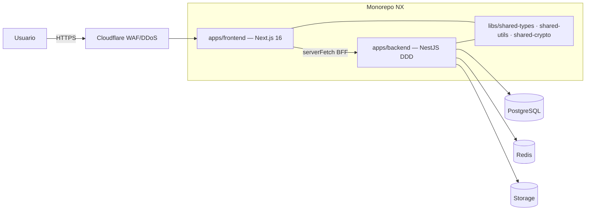

# 01 — Architecture

> Documento vivo. Actualizar con cada decisión arquitectónica (ADR), nuevo índice
> de BD, o cambio en las capas DDD.

## Diagrama de alto nivel



En local (Etapa 1) no hay Cloudflare/Auth0/GCS: el browser pega a Next.js
(localhost:3000), Next.js pega a NestJS (localhost:3001), NestJS a Postgres/Redis
Docker. Auth con `DevAuthGuard` (headers `x-dev-user-id`, `x-dev-user-role`).

## Capas DDD del backend (regla de dependencia unidireccional)

```
presentation → application → domain ← infrastructure
```

| Capa              | Contenido                                                                                     | Importa de                        |
| ----------------- | --------------------------------------------------------------------------------------------- | --------------------------------- |
| `domain/`         | entities, value-objects, repository interfaces, domain events, domain errors, factories       | nada (ni frameworks)              |
| `application/`    | use-cases (1 por acción), ports (INotificationPort, ICachePort…), DTOs                        | `domain/`                         |
| `infrastructure/` | Sequelize models + repos, Redis/GCS/Auth0 adapters, config                                    | `domain/`, `application/`         |
| `presentation/`   | controllers, guards, pipes (ZodValidationPipe), filters (GlobalExceptionFilter), interceptors | `application/`, `infrastructure/` |

Enforced por ESLint `@nx/enforce-module-boundaries`.

## Patrones obligatorios

Repository · Factory · Singleton (NestJS DI) · Strategy (notificaciones, pagos,
export) · Observer/Event-Driven (domain events) · Decorator (caché/logging/métricas).
SOLID no negociable. Cero errores sin controlar (errores de dominio tipados →
GlobalExceptionFilter).

## ADRs

- **ADR-001 (2026-06-01):** Monorepo NX **in-place** sobre el repo actual (no repo
  hermano nuevo). Razón: conservar historial git y remote. Implica `git mv` del
  Next.js a `apps/frontend/`.
- **ADR-002:** Gestor **pnpm** (vía corepack/user-local, sin sudo).
- **ADR-003 (pendiente validar):** Integración Next.js↔NX. Next 16 es muy nuevo;
  si `@nx/next` no soporta Next 16, usar target `nx:run-commands` envolviendo
  `next dev/build` nativo. Decidir al ejecutar Paso de migración del frontend.
- **ADR-004:** Backend NestJS + Sequelize + DDD. IA actual es **Gemini** (no
  OpenAI/Anthropic) — el `INotification`/AI port debe abstraer el proveedor.
- **ADR-005 (2026-06-04):** Lecturas con PII descifrada **owner-scoped** para features del propio doctor.
  `GET /api/consultations/with-patient` (billing) devuelve patient_name/phone/email descifrados —
  excepción justificada al masking por defecto: el doctor es dueño/autor y necesita el dato para emitir
  recibos. Regla: doble scope anti-IDOR (consultas Y pacientes filtrados por user.sub), **mapper dedicado**
  (NUNCA reusar el list mapper enmascarado), endpoint NO expuesto a admin/terceros. Sin audit por fila (no
  es /reveal de datos enmascarados, es acceso del dueño vía feature). El use case cruza módulos inyectando
  `PATIENT_REPOSITORY` (PatientsModule importado) — patrón ya usado por booking. **Pendiente:** pasar
  security-agent en QA sobre este endpoint.
- **ADR-006 (2026-06-04):** **RBAC por capacidades definido en BD** (módulo `capabilities`). Qué módulos/
  acciones (view/create/edit/delete) puede cada ROL se define en la tabla `role_capabilities` (seed por rol).
  Resolución **por request en el backend** (use case `ResolveCapabilities(role)` con cache Redis
  `capabilities:{role}` TTL 300s + invalidación al editar; degrada a BD si Redis cae; default-deny). El token
  (DevAuthGuard hoy, Auth0 mañana) lleva **solo el rol** — las capacidades NO se hornean en el token, así un
  cambio en BD aplica al instante sin re-login (requisito explícito del usuario). El resolver es agnóstico de
  la fuente de auth (lee `CurrentUser.role`), por eso Auth0-ready sin cambios. Enforcement: `CapabilitiesGuard`
  - `@RequireCapability(module, action)` en el backend (coexiste con `RolesGuard`, que sigue para "debe ser
    super_admin"). Frontend consume `GET /api/me/capabilities` para gating de vistas (helper `can()` en
    `lib/capabilities.ts`). **Combinación con plan_features:** un módulo se muestra si el ROL puede verlo
    (capacidades) Y el PLAN lo habilita (plan_features) — dos puertas ortogonales. Admin edita vía
    `GET/PUT /api/admin/role-capabilities` (super_admin).

## Inventario de tablas (auditoría Fase 0 — fuente de verdad: archivos `*.sql`)

Core: `profiles`, `appointments`, `consultations`, `patients`, `patient_packages`,
`prescriptions`, `ehr_records`, `consultation_payments`, `payments`, `payment_items`.

Suscripción/planes: `subscriptions`, `subscription_payments`, `subscription_changes_log`,
`subscription_status_view`, `plan_configs`, `plan_features`, `plan_promotions`,
`pricing_plans`, `package_templates`.

Doctor config: `doctor_offices`, `doctor_availability`, `doctor_schedule_config`,
`doctor_templates`, `doctor_consultation_blocks`, `doctor_quick_items`,
`doctor_blocked_slots`, `consultation_block_catalog`, `consultation_block_catalog`,
`specialty_default_blocks`, `doctor_suggestions`.

Otros: `patient_messages`, `leads`, `lead_messages`, `shared_files`, `avatars`,
`invoices`, `billing_documents`, `accounts_payable`, `payment_accounts`,
`app_settings`, `admin_roles`, `reminders_queue`, `ai_request_log`,
`appointment_changes_log`, `package_balance_log`.

> El schema completo vive en los `.sql` de la raíz (`00_PASO1_*`, `01_PASO2_*`,
> `sql_migration_v24/v25`, `sql_seed_ehr`) y `migrations/`. La migration inicial de
> Sequelize (`001-initial-schema`) debe reproducirlo (Fase 3).

## Campos PHI a encriptar (AES-256-GCM por campo + `*_search_hash` HMAC)

`patients`: cedula, full_name, phone, email (+ `cedula_search_hash`,
`full_name_search_hash`, `email_search_hash`) · `ehr_records`: diagnosis,
treatment_plan · `consultations`: chief_complaint, diagnosis, treatment ·
`prescriptions`: medication (NO medication_name), dosage. Masking por defecto en listas;
`/reveal` registra en `access_audit_log`.

## Estrategia de caché (Redis TTLs)

config/planes/features 1h · perfil doctor 15m · slots agenda 2m · KPIs admin 5m ·
tasa USDT 10m. Invalidación por evento (update perfil → `profile:{id}`; cita →
`slots:{doctorId}:{date}`).

## Índices clave (Fase 6)

`appointments(doctor_id, scheduled_at)` · `patients(doctor_id)` ·
`patients(cedula_search_hash)` · `consultations(doctor_id, consultation_date)` ·
`subscriptions(doctor_id, status)`.

## Decisiones de implementación (Fase 3 — realizadas)

- **Cifrado en la capa repositorio, no en hooks del modelo.** El dominio opera SIEMPRE en
  plaintext; el repo cifra al escribir y descifra al leer vía `CryptoService` (CryptoModule
  @Global en `infrastructure/crypto/`). Más testeable y DDD-puro que los hooks Sequelize.
- **`CryptoService` global compartido:** encrypt/decrypt AES-256-GCM (IV aleatorio 12B + authTag,
  base64 iv||ct||tag) y `hashForSearch` HMAC-SHA256 (normaliza: trim/lowercase/NFD-sin-acentos).
  Llaves de ConfigService (`ENCRYPTION_KEY`, `ENCRYPTION_HMAC_SECRET`); guard al boot que rechaza
  llaves triviales fuera de development. `decrypt` fallido → `DecryptionError` (422, no 500).
- **Búsqueda sobre datos cifrados — híbrido:** lookup exacto por `*_search_hash` (HMAC determinístico,
  indexado) para cédula/email; búsqueda parcial/orden descifrando in-app dentro del scope del doctor
  (set acotado). El ciphertext (nonce aleatorio) NO es indexable directamente.
- **Anti-IDOR (doble capa):** `doctor_id` siempre de `user.sub` (nunca del body); además `doctor_id`
  en el WHERE del repo (findById/update/softDelete) → acceso cross-doctor devuelve not-found.
- **Masking en la capa de presentación** (mappers), nunca en use-case/repo. Listas mínimas.
- **Migraciones `.cjs`** con sequelize-cli (TS frágil en NX). Una migración por cambio incremental
  (appointment_changes_log, patients soft-delete, consultations payment_date).
- **Gate de ESLint** en backend (no-explicit-any, no-floating-promises, no-console).
- **Proceso de equipo (Agent Teams):** implementer → code-reviewer (+ security-agent si PHI) →
  fixes → el lead VERIFICA el código por línea y corre build/lint/test (los sub-agentes han
  sobre-declarado; no se commitea con la sola palabra del agente). Ver `.claude/agents/orchestrator.md`.
- **Pitfall DI/webpack (¡importante!):** NUNCA declarar `Sequelize` ni infra global en el array
  `providers` de un módulo NestJS — compila y pasa los tests (TestingModule) pero CRASHEA el
  servidor compilado (`dist`). Inyectar del DI global. **Verificación obligatoria por módulo:**
  bootear el dist (`node dist/apps/backend/main.js`) + smoke real, no solo tests.
- **Optimistic lock:** consumo de sesión de paquete = `UPDATE ... WHERE used_sessions=:current AND
status='active'` con `QueryTypes.UPDATE` (devuelve `[undefined, affectedCount]`; 0 filas → retry x3
  → InsufficientSessionsError). NO usar `QueryTypes.RAW` + extraer rowCount (frágil con pg).
- **Transacciones:** flujos que tocan ≥2 escrituras relacionadas (booking = cita + consumo de paquete)
  van en `sequelize.transaction(async t => ...)` con el `transaction` threadeado a cada repo
  (los métodos de repo aceptan `transaction?` opcional). DomainError mapea a 422 salvo `httpStatus`
  override (404/400 en superficies públicas).
- **Superficie pública (booking):** sin auth → validación Zod estricta de TODO input, 404 anti-enumeración,
  sin exponer ids internos, PII cifrada vía patients repo. DEUDA Etapa 2: Turnstile real + rate limiting.
- **Autorización por rol:** `RolesGuard` (`presentation/guards/roles.guard.ts`) + `@Roles('super_admin')`
  sobre DevAuthGuard. Fail-closed (sin user o rol no incluido → 403). Endpoints admin lo usan.
- **Resiliencia de Redis:** TODA llamada a Redis (cache get/set, SCAN+DEL de invalidación) va en
  try/catch → si Redis cae, el endpoint DEGRADA a la BD, no devuelve 500. Redis es acelerador, no
  dependencia dura. Invalidación con SCAN+DEL (NUNCA `KEYS`, que bloquea).
- **Dinero:** `Money` VO (USD/BS, no-negativo en construcción). Pero los AGREGADOS con signo (net =
  ingresos − gastos, que puede ser negativo) se calculan como `number` plano, NO por el constructor de
  Money. Tasa USDT cacheada en Redis (TTL 600s) con fallback a `app_settings`; guard contra NaN.
- **Migración del frontend (BFF):** `apps/frontend` se reconecta al backend y ELIMINA Supabase.
  Thin-proxy: route handlers / `actions.ts` llaman al backend vía `lib/api-client.server.ts`
  (SERVER-ONLY, `Result<T,AppError>`), sin tocar la UI. Auth = dev-stub (`lib/dev-auth.ts`, headers
  x-dev-\*) en Etapa 1 → Auth0 Fase 4. Middleware = `proxy.ts` (convención Next 16, reemplaza
  middleware.ts). El frontend NUNCA importa apps/backend (solo HTTP). Storage → GCS (Fase 5).
