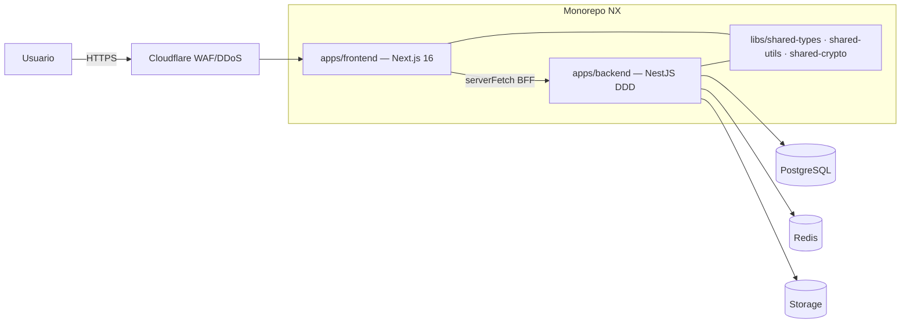

# 01 — Architecture

> Documento vivo. Actualizar con cada decisión arquitectónica (ADR), nuevo índice
> de BD, o cambio en las capas DDD.

## Diagrama de alto nivel



En local (Etapa 1) no hay Cloudflare/Auth0/GCS: el browser pega a Next.js
(localhost:3000), Next.js pega a NestJS (localhost:3001), NestJS a Postgres/Redis
Docker. Auth con `DevAuthGuard` (headers `x-dev-user-id`, `x-dev-user-role`).

## Capas DDD del backend (regla de dependencia unidireccional)

```
presentation → application → domain ← infrastructure
```

| Capa | Contenido | Importa de |
|------|-----------|-----------|
| `domain/` | entities, value-objects, repository interfaces, domain events, domain errors, factories | nada (ni frameworks) |
| `application/` | use-cases (1 por acción), ports (INotificationPort, ICachePort…), DTOs | `domain/` |
| `infrastructure/` | Sequelize models + repos, Redis/GCS/Auth0 adapters, config | `domain/`, `application/` |
| `presentation/` | controllers, guards, pipes (ZodValidationPipe), filters (GlobalExceptionFilter), interceptors | `application/`, `infrastructure/` |

Enforced por ESLint `@nx/enforce-module-boundaries`.

## Patrones obligatorios

Repository · Factory · Singleton (NestJS DI) · Strategy (notificaciones, pagos,
export) · Observer/Event-Driven (domain events) · Decorator (caché/logging/métricas).
SOLID no negociable. Cero errores sin controlar (errores de dominio tipados →
GlobalExceptionFilter).

## ADRs

- **ADR-001 (2026-06-01):** Monorepo NX **in-place** sobre el repo actual (no repo
  hermano nuevo). Razón: conservar historial git y remote. Implica `git mv` del
  Next.js a `apps/frontend/`.
- **ADR-002:** Gestor **pnpm** (vía corepack/user-local, sin sudo).
- **ADR-003 (pendiente validar):** Integración Next.js↔NX. Next 16 es muy nuevo;
  si `@nx/next` no soporta Next 16, usar target `nx:run-commands` envolviendo
  `next dev/build` nativo. Decidir al ejecutar Paso de migración del frontend.
- **ADR-004:** Backend NestJS + Sequelize + DDD. IA actual es **Gemini** (no
  OpenAI/Anthropic) — el `INotification`/AI port debe abstraer el proveedor.

## Inventario de tablas (auditoría Fase 0 — fuente de verdad: archivos `*.sql`)

Core: `profiles`, `appointments`, `consultations`, `patients`, `patient_packages`,
`prescriptions`, `ehr_records`, `consultation_payments`, `payments`, `payment_items`.

Suscripción/planes: `subscriptions`, `subscription_payments`, `subscription_changes_log`,
`subscription_status_view`, `plan_configs`, `plan_features`, `plan_promotions`,
`pricing_plans`, `package_templates`.

Doctor config: `doctor_offices`, `doctor_availability`, `doctor_schedule_config`,
`doctor_templates`, `doctor_consultation_blocks`, `doctor_quick_items`,
`doctor_blocked_slots`, `consultation_block_catalog`, `consultation_block_catalog`,
`specialty_default_blocks`, `doctor_suggestions`.

Otros: `patient_messages`, `leads`, `lead_messages`, `shared_files`, `avatars`,
`invoices`, `billing_documents`, `accounts_payable`, `payment_accounts`,
`app_settings`, `admin_roles`, `reminders_queue`, `ai_request_log`,
`appointment_changes_log`, `package_balance_log`.

> El schema completo vive en los `.sql` de la raíz (`00_PASO1_*`, `01_PASO2_*`,
> `sql_migration_v24/v25`, `sql_seed_ehr`) y `migrations/`. La migration inicial de
> Sequelize (`001-initial-schema`) debe reproducirlo (Fase 3).

## Campos PHI a encriptar (AES-256-GCM por campo + `*_search_hash` HMAC)

`patients`: cedula, full_name, phone, email · `ehr_records`: diagnosis,
treatment_plan · `consultations`: chief_complaint, diagnosis, treatment ·
`prescriptions`: medication_name, dosage. Masking por defecto en listas;
`/reveal` registra en `access_audit_log`.

## Estrategia de caché (Redis TTLs)

config/planes/features 1h · perfil doctor 15m · slots agenda 2m · KPIs admin 5m ·
tasa USDT 10m. Invalidación por evento (update perfil → `profile:{id}`; cita →
`slots:{doctorId}:{date}`).

## Índices clave (Fase 6)

`appointments(doctor_id, scheduled_at)` · `patients(doctor_id)` ·
`patients(cedula_search_hash)` · `consultations(doctor_id, consultation_date)` ·
`subscriptions(doctor_id, status)`.
